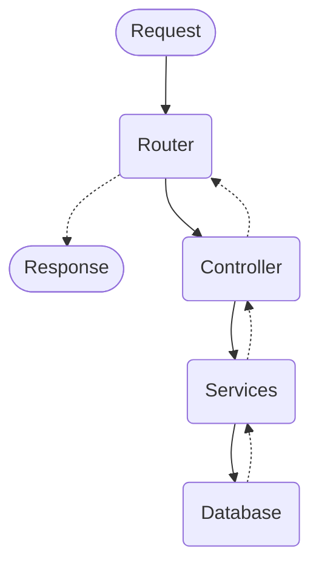

# APIResCRUDExample-Post That!
## **About the project**
This is and example of an API RES with CRUD operations about users and posts using NodeJS and Fastify for the API, and Postgres and Prisma for the database.

We can use this API as an independent part of a bigger application which it also can has a frontend (i.e: web app) and it asks for data to represent.

This API will simulate a very tiny social media about posts and users (similar to Twitter). It was designed to be highly scalable in the future and developer friendly.

## **Table of Contents**
- [APIResCRUDExample-Post That!](#apirescrudexample-post-that)
  - [**About the project**](#about-the-project)
  - [**Table of Contents**](#table-of-contents)
  - [**Tecnologies used**](#tecnologies-used)
  - [**Version**](#version)
  - [**API Structure**](#api-structure)
  - [**Project status**](#project-status)
  - [**API Documentation**](#api-documentation)
  - [**Setup**](#setup)
    - [Environment variables](#environment-variables)
    - [Install project](#install-project)
    - [Create Postgresql Database and connect Prisma.](#create-postgresql-database-and-connect-prisma)
    - [Run the project](#run-the-project)
  - [**Docker deployment**](#docker-deployment)
  - [**License**](#license)
  - [**Contact**](#contact)
## **Tecnologies used**
At this moment, this project uses the following technology:
* Fastify: 4.20.0
* Fastify-Jwt: 7.2.0
* Fastfiy-Swagger: 8.8.0
* Fastify-Zod: 1.3.2
* Prisma: 5.0.0
* Prisma-client: 5.0.0
* Config: 3.3.9
* Dotenv: 16.3.1
* Nodemon: 3.0.1
* Zod: 3.21.4

It can be also seen in `package.json`
## **Version**
At this moment, this API is at version 1.0.0 . Which it is the first "minimal" and "stable" version of the API.
Can be modified for fixing bugs.
## **API Structure**
This is the internal structure of the API:

## **Project status**
This project serves as a skeleton and example for creating restful APIs with CRUD for your data, and its functionality will not be configured at this time. It will remain under the same operation, except for corrections.
This is due to my short time currently, but in the future it will continue with its development.
## **API Documentation**
After starting the server, you can check all the endpoints and all the documentation in:
`[host]:[port]/docs`
Where `[host]` and `[port]` are the address and port on which the server is located.
In example, it can be `0.0.0.0:3000/docs`.
It will show the generated documentation by fastify and swagger.
## **Setup**
### Environment variables
1. Copy the `.env.template` file.
2. Rename the copy as `.env`.
3. Change the variables inside the copy with the real data for you.

You can find more information about this variables commented inside `.env.template` file.
### Install project
1. Clone/Download this repository
2. Execute command `npm install` in the main folder.
### Create Postgresql Database and connect Prisma.
1. Create a new database in Postgresql using command line or client version (like pgAdmin 4) 
2. Change the `DATABASE_URL` inside .env and add the credentials of your database user and the database name. If your database is in another machine/docker container, change `HOST` and `PORT` with the address of the database.
3. Run command `npx prisma migrate dev --name init`. "init" it's the name of the migration. You can change it to whatever you prefer. It will migrate the schema of the project to your database and connect it to prisma and the API.
### Run the project
1. Execute command `npm run start` for starting the project. Nodemon will help by keeping the server up and refreshing after every change. It will also compiles the code.

For compiling only, use `npm run build`.
## **Docker deployment**
Having installed Docker in the machine which will contain the container:
1. Run `docker compose build` for building the image
2. Run `docker compose up` for starting the containter

**IMPORTANT NOTE**: The configuration that is uploaded in this repository is ready to launch the container from a local machine to a local database. In the file `docker-compose.yml` we are indicating that `network_mode` is `"host"`. It means that the container will use the same networking as the host, in order to share the localhost. Also, it is important to remember that if you are using Postgres with docker OR in another machine, you will have to indicate it in the `DATABASE_URL` variable at .env file, changing `HOST` and `PORT`.
## **License**
Distributed under the GPL-3.0 License. See `LICENSE.txt` for more information.
## **Contact**
Sera - serafincortesramirez@gmail.com 

Project link: https://github.com/sera-cr/APIResCRUDTest-PostsExample
